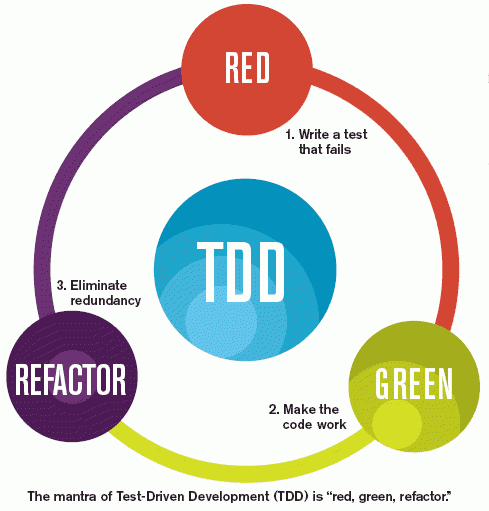

# TDD-ProjectEuler(using Python)
Here I hope show for everyone who have a interest in how is the way that test works, how to do this, solving some problems of the ProjectEuler.

In this project, I am loocking for pratictice the TDD behavior. Even the ProjectEuler problems can be a purely a mathematical problem, I guess it might be a good idea to pratice the TDD mantra.

